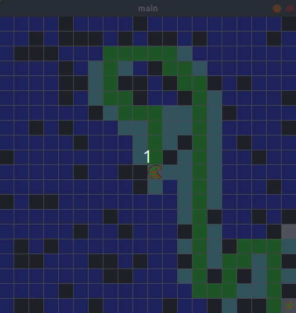

# Pacman

Try to find **shortest path** for pacman to reach the goal with 3 diffrent algorithmes.

## How to use it

1. [Download](http://py.processing.org/processing.py-windows64.zip) the Processing.py JAR file
2. Put the jar file in project main directory
3. Run command `java -jar processing-py.jar main.py`

## Examples

**Dark Blue** cells: **explored** cells  
**Light Blue** cells: **frontier** cells

### BFS

Using **queue** for choosing element from frontier.

### DFS

Using **stack** for choosing element from frontier.

### A*

Choose element from frontier with **lowest f**.  
**Manhattan-distance** use for heuristic.

