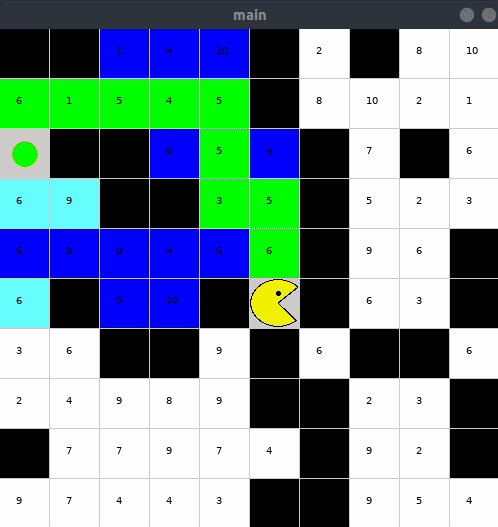
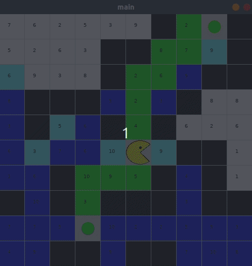
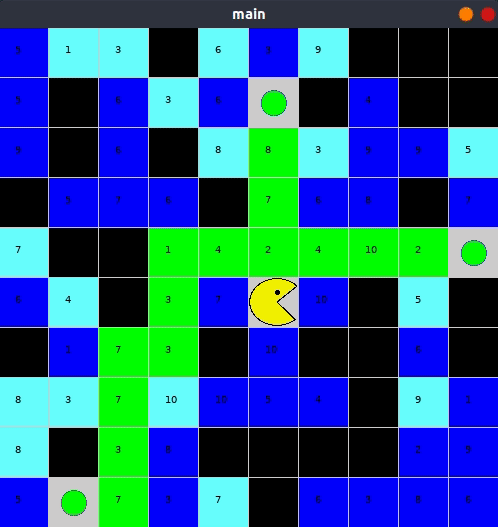
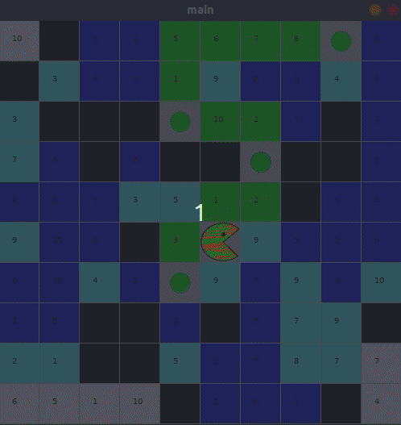
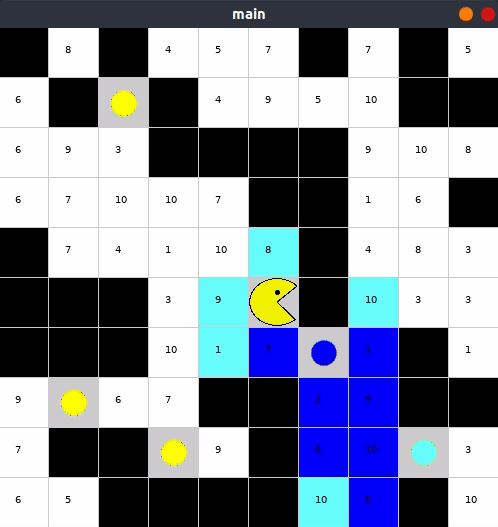

# Pacman with weight

Try to find **optimal** path for pacman to eat **all the dots**. every cell has a **weight**.

## How to use it

1. [Download](http://py.processing.org/processing.py-windows64.zip) the Processing.py JAR file
2. Put the jar file in project main directory
3. Run command `java -jar processing-py.jar main.py`

## Examples

**Dark Blue** cells => **explored** cells  
**Light Blue** cells => **frontier** cells

`Note: FrameRate are increasingly change due to boring process! `

### One Dot

- **Moves**: ['UP', 'UP', 'LEFT', 'UP', 'UP', 'LEFT', 'LEFT', 'LEFT', 'LEFT', 'DOWN']

- **Total Cost**: 40

### Two Dot

- **Moves**: ['DOWN', 'LEFT', 'LEFT', 'DOWN', 'DOWN', 'UP', 'UP', 'RIGHT', 'RIGHT', 'UP', 'UP', 'UP', 'UP', 'RIGHT', 'UP', 'RIGHT', 'UP', 'RIGHT']
- **Total Cost**: 85

### Three Dot

- **Moves**: ['UP', 'RIGHT', 'RIGHT', 'RIGHT', 'RIGHT', 'LEFT', 'LEFT', 'LEFT', 'LEFT', 'UP', 'UP', 'UP', 'DOWN', 'DOWN', 'DOWN', 'LEFT', 'LEFT', 'DOWN', 'DOWN', 'LEFT', 'DOWN', 'DOWN', 'DOWN', 'LEFT']
- **Total Cost**: 103

### Four Dot

- **Moves**: ['LEFT', 'DOWN', 'UP', 'RIGHT', 'UP', 'RIGHT', 'UP', 'UP', 'LEFT', 'LEFT', 'UP', 'UP', 'RIGHT', 'RIGHT', 'RIGHT', 'RIGHT']
- **Total Cost**: 48

### Five Dot

- **Moves**: ['DOWN', 'RIGHT', 'DOWN', 'DOWN', 'RIGHT', 'RIGHT', 'LEFT', 'LEFT', 'UP', 'UP', 'LEFT', 'LEFT', 'LEFT', 'DOWN', 'DOWN', 'UP', 'LEFT', 'LEFT', 'RIGHT', 'RIGHT', 'UP', 'UP', 'UP', 'LEFT', 'UP', 'UP', 'UP']
- **Total Cost**: 125

