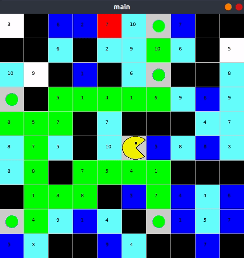
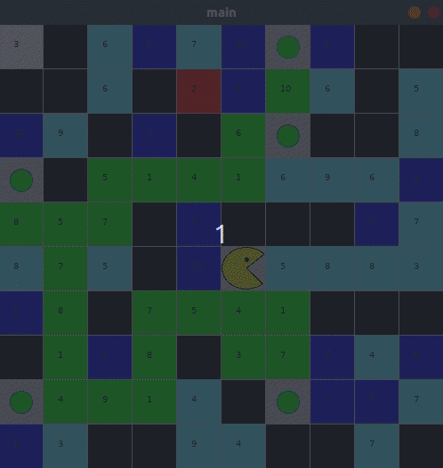
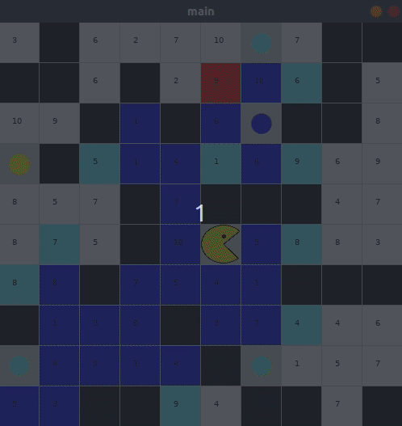

# Pacman with weight

Try to find **optimal** path for pacman to eat **all the dots**. every cell has a **weight**.

## How to use it

1. [Download](http://py.processing.org/processing.py-windows64.zip) the Processing.py JAR file
2. Put the jar file in project main directory
3. Run command `java -jar processing-py.jar main.py`

## Examples

**Dark Blue** cells => **explored** cells  
**Light Blue** cells => **frontier** cells

### Breadth First Search

- Total Time: **21.88**  
- Total Nodes: **1551**  
- Total Cost: **140**  

['DOWN', 'DOWN', 'RIGHT', 'DOWN', 'UP', 'UP', 'LEFT', 'LEFT', 'LEFT', 'DOWN', 'DOWN', 'LEFT', 'LEFT', 'LEFT', 'RIGHT', 'UP', 'UP', 'UP', 'UP', 'LEFT', 'UP', 'DOWN', 'RIGHT', 'RIGHT', 'UP', 'RIGHT', 'RIGHT', 'RIGHT', 'UP', 'RIGHT', 'UP', 'UP']

### Uniform Cost Search

- Total Time: **17.94**  
- Total Nodes: **1355**  
- Total Cost: **132**

['DOWN', 'RIGHT', 'DOWN', 'DOWN', 'UP', 'UP', 'LEFT', 'LEFT', 'LEFT', 'DOWN', 'LEFT', 'LEFT', 'DOWN', 'LEFT', 'RIGHT', 'UP', 'UP', 'UP', 'UP', 'LEFT', 'UP', 'DOWN', 'RIGHT', 'RIGHT', 'UP', 'RIGHT', 'RIGHT', 'RIGHT', 'RIGHT', 'UP', 'UP', 'UP']

### A*

- Total Time: **1.01**  
- Total Nodes: **202**  
- Total Cost: **132**  

['DOWN', 'RIGHT', 'DOWN', 'DOWN', 'UP', 'UP', 'LEFT', 'LEFT', 'LEFT', 'DOWN', 'LEFT', 'LEFT', 'DOWN', 'LEFT', 'RIGHT', 'UP', 'UP', 'UP', 'UP', 'LEFT', 'UP', 'DOWN', 'RIGHT', 'RIGHT', 'UP', 'RIGHT', 'RIGHT', 'RIGHT', 'RIGHT', 'UP', 'UP', 'UP']

